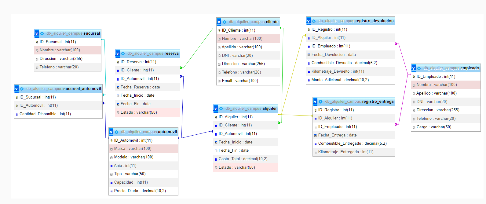

# RentCar

### OBJETIVO GENERAL:

Mejorar el sistema de gestión de alquileres y reservas de autos para optimizar el proceso y
brindar un mejor servicio a los clientes.

### OBJETIVO ESPECIFICO:

La solución propuesta consiste en desarrollar una aplicación
web utilizando Node.js y Express para el backend. Se utilizará
una base de datos MySQL para almacenar toda la información
relacionada con los clientes, automóviles, alquileres, reservas,
sucursales y empleados.

## Diagrama base de datos:

## Pasos para realizar la descarga y utilización del archivo.

1. Abre Visual Studio y selecciona "Clonar un repositorio" o en inglés "clone git repository"
2. copia y pega el siguiente link: https://github.com/DiegoMartinez2094/RetoalquilerAutos.git, selecciona el destino donde se guardará el archivo seguido oprime abrir,
   tendrás una lista de archivos.
3. ahora descargamos la extension MySQL permite a los desarrolladores de Visual Studio interactuar con bases de datos MySQL directamente desde el entorno de desarrollo.
4. Al abrir la extension Mysql encontramos un entorno de conexión donde debemos poner los datos de comunicacion el hostname el puerto, entre otros, a continuación un ejemplo: nota: este ejemplo es según la configuracion que tengas

   "name":"db_campus_alquiler"host": "localhost", "username":"campus", "password":"campus2023", "database":"db_campus_alquiler", "port":3306.
5. Seguido de ello abrimos la terminal, en la parte superior del visual, en la opcion  new terminal, aquí se pondrá cada uno de los comandos que a continuación se dictarán, debemos asegurarnos que tengamos instalado nvm para ello utilizamos el comando `nvm --version` de no ser así, Para instalar NVM, sigue las instrucciones en su sitio oficial: [https://github.com/nvm-sh/nvm](https://github.com/nvm-sh/nvm),  luego  instalamos node con el siguiente comando `nvm install node ` empezará la descarga (este archivo contiene node y npm) npm lo utilizaremos más adelante para instalar las dependencias que necesita el programa para funcionar.
6. Ponemos en uso node con el siguiente comando: `nvm use node`, nos saldrá un aviso : now using node junto a la versión.
7. Ingresamos el comando `npm install,` nos servirá para instalar todas las dependencias necesarias, en la terminal nos saldrá  una barras de descarga, cuando finalice se creará un archivo package-lock.json y una carpeta node_modules.
8. Seguido debemos crear un archivo llamado ".env" estos son archivos de configuración que se utilizan para almacenar variables de entorno en aplicaciones y proyectos, en nuestro caso almacenaremos variables de conexión tanto del servidor como de la base de datos, dento del archivo tndremos la siguiente informacion:
   Debemos cambiar las xxx por la configuracion que necesitemos:

   MY_CONFIG={"hostname":"xxx", "port":xxx} /*esta será la configuracion para levantar el servidor*/

   DB_CONEXION={"hostname": "xxx", "user":"xxx", "password":"xxx", "database":"gymdatabase", "port":xxx} /*esta será la configuracion de conexion para la base de datos*/

   MY_CONFIG={"hostname":"127.0.0.2", "port":5085}

   DB_CONEXION={"hostname": "localhost", "user":"campus", "password":"campus2023", "database":"db_campus_alquiler", "port":3306}.
9. Ahora levantamos el servidor con el comando `npm run dev` nos enviará un mensaje con la direccion y el puerto que estamos usando
10. En dado caso salga un error.
11. nos indica que el puerto donde se iniciará el servidor ya está siendo usado por otro programa, entonces debemos cambiarlo en el archivo .env el cuál almacena las variables de entorno en este caso la variable de conexión del servidor.
    ejemplo:(debe cambiar las xxx)

    MY_CONFIG={"hostname":"127.0.0.2", "port":xxx}
12. Debemos ejecutar el archivo basedatos.sql el cual contiene la creación de las tablas con sus relaciones y además  informacion que por defecto llenará la base de datos que vamos a usar, para ello abrimos el archivo, activamos la conexión  y oprimimos click izquierdo seguido la teclas Ctrl+A luego Ctrl+Enter, esto ejecutará todo el archivo .sql
13. Ahora procedemos a realizar las consultas, en este caso utilizaremos la extension de visual estudio ***ThunderClient***, para ello la buscaremos e instalaremos en nuestro visual.

    abrimos la extension, seleccionamos New Request

Es importante siempre tener abierta la terminal con el comando `<npm run dev>`

Finalmente  realizamos pruebas con los metodos Get de los respectivos enpoints:

cambiamos la url, copiamos la que nos esté saliendo en la terminal y agregamos  un / seguido del endpoint al que vamos a hacer la solicitud:

los endpoints disponibles son:

ejemplos (recuerde que debe cambiar el host y el puerto segun su configuració):

Mostrar todos los clientes registrados en la base de datos:

http://127.0.0.2:5033/cliente

Obtener todos los automóviles disponibles para alquiler:

http://127.0.0.2:5033/automovil

Listar todos los alquileres activos junto con los datos de los
clientes relacionados:

http://127.0.0.2:5033/alquilerEstado/Activo

Mostrar todas las reservas pendientes con los datos del cliente
y el automóvil reservado:

http://127.0.0.2:5033/reserva

Obtener los detalles del alquiler con el ID_Alquiler específico (cambia la x por el id que quieras buscar):

http://127.0.0.2:5033/alquiler/x

Listar los empleados con el cargo de "Vendedor":

http://127.0.0.2:5033/empleadoCargo/Vendedor

Listar los clientes con el DNI específico (cambia la x por un DNI especifico):

http://127.0.0.2:5033/clienteDNI/x

Obtener los detalles del alquiler que tiene fecha de inicio en 2023-07-05:

http://127.0.0.2:5033/alquilerFI/2023-07-05

Listar las reservas pendientes realizadas por un cliente especifico:

http://127.0.0.2:5033/reservaIdCliente

Mostrar los empleados con cargo de "Gerente" o "Asistente":

http://127.0.0.2:5033/empleadoCargo/Gerente

http://127.0.0.2:5033/empleadoCargo/Asistente

Obtener los datos del cliente que realizó la reserva con ID_Reserva específico.(cambia la x por el id de la reserva)

http://127.0.0.2:5033/reservaIdReserva/x
